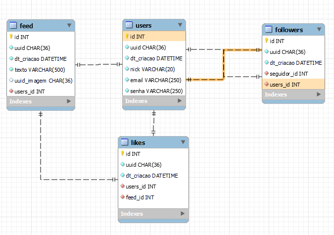

# Projeto para uma Vaga de Programador Python

O projeto possui 3 Branchs:
- A master - Que possui a documentação e a inicialização do projeto
- Django - A primeira versão do projeto que iniciei em Django, porém tive alguns problemas
- Flask - A versão mais recente e mais finalizada do projeto

Ao final do projeto irei fazer o merge com a Master

### Descrição
O projeto se trata de uma API RESTFUL para um sistema de midia social, onde os usuários poderão:
- [x] Registrar e Autenticar
- [ ] Criar, Editar, Deletar e Curtir Postagens
- [ ] Seguir e Deixar de Seguir Outros Usuários
- [x] Visualizar o Feed

As Views e Models foram separados em vários arquivos nas suas respectivas pastas para garantir um código mais limpo.

Infelizmente, por motivos da correria de trabalho e tempo tive que migrar o projeto para o flask, pois no Django estava dando alguns problemas que não estava conseguindo resolver e como sou mais familiarizado com o flask, para não perder a oportunidade a solução foi essa.

### Banco de Dados
O banco de dados está em Postgresql 16, porém a estrutura foi desenhada usando o MySQL Workbench

### Documentações
- [Sobre o Projeto](./docs/README.md)
- [Documentação em Postman](./docs/MkVerse%20-%20Teste%20B2Bit.postman_collection.json)
- [Estrutura do Projeto](./docs/estrutura_projeto.md)